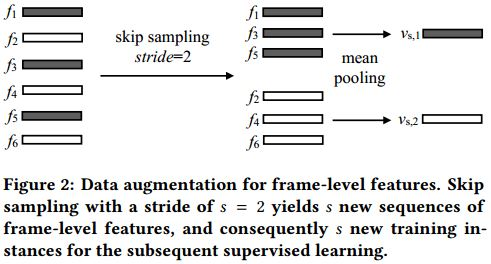

# Feature Re-Learning with Data Augmentation for Content-based Video Recommendation

We release source code of our winning entry for the [Hulu Content-based Video Relevance Prediction Challenge](https://github.com/cbvrp-acmmm-2018/cbvrp-acmmm-2018) at the ACM Multimedia 2018 conference. The solution is mainly a feature re-learning model enhanced by data augmentation that works for both frame-level and video-level features.


## Requirements
#### Required Packages
* **python** 2.7
* **PyTorch** 0.3.1
* **tensorboard_logger** for tensorboard visualization

We used virtualenv to setup a deep learning workspace that supports PyTorch.
Run the following script to install the required packages.
```shell
virtualenv --system-site-packages ~/cbvr
source ~/cbvr/bin/activate
pip install -r requirements.txt
deactivate
```

#### Required Data
1. Download track_1_shows(6G) and track_2_movies(9.0G) datasets from [here](http://39.104.114.128/hulu_mm_2018/) or [Baidu Pan](https://pan.baidu.com/s/1v86WP7u-tcuO2qzh0CVAqQ#list/path=%2Fcbvr_data). If you have already downloaded the datasets provided by Hulu organizers, use the script [do_feature_convert.sh](do_feature_convert.sh) to convert the dataset to fit for our code.
2. Run the following script to extract the downloaded data. The extracted data is placed in `$HOME/VisualSearch/`.
```shell
ROOTPATH=$HOME/VisualSearch
mkdir -p $ROOTPATH
# extract track_1_shows and track_2_movies datasets
tar zxf track_1_shows.tar.gz -C $ROOTPATH
tar zxf track_2_movies.tar.gz -C $ROOTPATH
```


## Getting started
#### Augmentation for frame-level features


Run the following script to train and evaluate the model with augmentation for frame-level features.
```shell
source ~/cbvr/bin/activate
# on track_1_shows with stride=4
./do_all_frame_level.sh track_1_shows inception-pool3 4
# on track_2_shows with stride=4
./do_all_frame_level.sh track_2_movies inception-pool3 4
deactive
```
Running the script will do the following things:
1. Generate augmented frame-level features and operate mean pooling to obtain video-level features in advance.
2. Train the feature re-learning model with augmentation for frame-level features and select a checkpoint that performs best on the validation set as the final model.
3. Evaluate the final model on the validate set and generate predicted results on the test set. Note that we as participants have no access to the ground-truth of the test set. Please contact the [task organizers](https://github.com/cbvrp-acmmm-2018/cbvrp-acmmm-2018) in case you may want to evaluate our model or your own model on the test set.

#### Augmentation for frame-level features


Run the following script to train and evaluate the model with augmentation for video-level features.
```shell
source ~/cbvr/bin/activate
# on track_1_shows
./do_all_video_level.sh track_1_shows c3d-pool5
# on track_2_movies
./do_all_video_level.sh track_2_movies c3d-pool5
deactive
```
Running the script will do the following things:
1. Train the feature re-learning model with augmentation for video-level features and select a checkpoint that performs best on the validation set as the final model. (The augmented video-level features are generated on the fly.)
2. Evaluate the final model on the validate set and generate predicted results on the test set.


## How to perform the proposed augmentation for other video-related tasks?
The proposed augmentation essentially can be used for other video-related tasks.
[This note](augmentation.ipynb) shows
* How to perform data augmentation over frame-level features?
* How to perform data augmentation over video-level features?


## Citation
If you find the package useful, please consider citing our MM'18 paper:
```
@inproceedings{mm2018-cbvrp-dong,
title = {Feature Re-Learning with Data Augmentation for Content-based Video Recommendation},
author = {Jianfeng Dong and Xirong Li and Chaoxi Xu and Gang Yang and Xun Wang},
doi = {10.1145/3240508.3266441},
year = {2018},
booktitle = {ACM Multimedia},
}
```

## Acknowledgements
We are grateful to HULU organizers for the challenge organization effort.
```
@article{liu2018content,
  title={Content-based Video Relevance Prediction Challenge: Data, Protocol, and Baseline},
  author={Liu, Mengyi and Xie, Xiaohui and Zhou, Hanning},
  journal={arXiv preprint arXiv:1806.00737},
  year={2018}
}
```